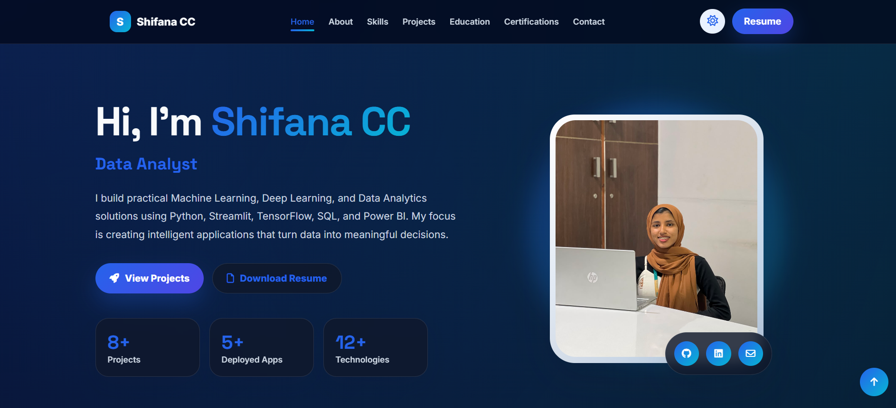

#   Data Analyst Portfolio

  

  
  
  
  

---

##   Live Portfolio

🌐 **Website:**  
**https://shifanacc.github.io/portfolio/**

---

## 📸 Portfolio Preview

  

---

##  About Me

Hi! I'm **Shifana**, an aspiring **Data Analyst** passionate about turning raw data into meaningful insights.

I enjoy building data-driven solutions using Python, SQL, Power BI, Excel, and Machine Learning.

---

##   Portfolio Features

-   Modern & Responsive Design
-   Mobile-Friendly Layout
-   Professional Project Showcase
-   Resume Download
-   Skills & Technologies
-   Contact Section
-   Hosted with GitHub Pages

---

##   Technologies Used

| Frontend | Tools |
|-----------|-------|
| HTML5 | GitHub |
| CSS3 | GitHub Pages |
| JavaScript | VS Code |

---

##   Featured Projects

###   Sales Analysis Dashboard
Power BI dashboard with interactive sales insights and KPIs.

###   Airbnb NYC Dashboard
Data visualization and business insights using Power BI.

###   FIFA Player Analysis
Exploratory Data Analysis (EDA) using Python.

###   Student Placement Prediction
Machine Learning model predicting student placement using Random Forest.

###   AI Stock Market Predictor
Interactive stock prediction application built with Machine Learning and Streamlit.

###   Enterprise AI Data Analyst
AI-powered enterprise analytics platform for transforming business data into actionable insights.

###   Cat vs Dog Image Classifier
Deep Learning CNN model for image classification.

---

##   Resume

Download my latest resume directly from the portfolio website.

---

## 📬 Connect With Me

-   Portfolio: https://shifanacc.github.io/portfolio/
-   GitHub: https://github.com/
-   LinkedIn: www.linkedin.com/in/shifana-cc
-   Email: shifanacc.186@gmail.com
  
---

##   Support

If you like this portfolio, consider giving this repository a **⭐ Star**.

It helps others discover my work and motivates me to build more projects.

---

Designed and Developed by <strong>Shifana</strong>

